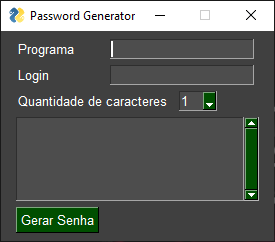

# Gerador de Senhas
[BR] Gerador de Senhas feito em python, utilizando o PySimpleGUI para criação da interface.<br>
[EN] Password Generator made in Python, using PySimpleGUI to create the interface.

## Imagem do Projeto:


# Clonando o Projeto
Requisitos: Python e Git instalados. <br><br>
Abra Git Bash.<br>
Altere o diretório de trabalho atual para o local em que deseja ter o diretório clonado.
```bash
git clone https://github.com/EduardoCdeO/Gerador-de-Senhas.git
```

# Configurando ambiente virtual(opcional, mas recomendado)
Abra seu terminal e entre na pasta (altere o caminho-do-diretório pelo caminho do local em que você clonou o repositório)<br>
```bash
cd caminho-do-diretório/Gerador-de-Senhas
```
## Criando o ambiente virtual:
```bash
python -m venv venv
```
## Ativando o ambiente virtual:

No Windows:
```bash
venv\Scripts\activate
```

No macOS/Linux:
```bash
source venv/bin/activate
```

# Instale as dependências
```bash
pip install -r requirements.txt
```

## Inicie a aplicação:
```bash
python password_gen.py
```
